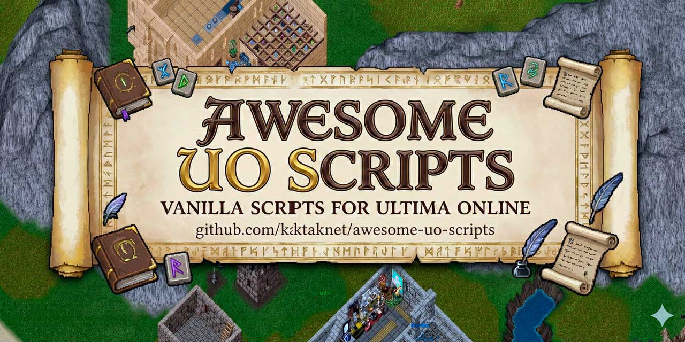

<div align="center">


# Awesome Ultima Online Scripts

</div>

> A curated collection of **756+ script packages** for Sphere Server - the free Ultima Online server emulator. Fully documented with meaningful naming and organized for easy discovery.

**Status:** ✅ Fully Documented and Organized
**Last Updated:** 2025-12-07
**Total Scripts:** 756 with README documentation
**Awesome Badge:** [](https://awesome.re)
**Wiki:** 📖 [Comprehensive Wiki Guide](https://github.com/kaktaknet/awesome-uo-scripts/wiki)

## Overview

A comprehensive, well-organized repository of **756+ Sphere Server scripts** sourced from the legendary **[mirror.ashkantra.de/scripts/Sphere/](https://mirror.ashkantra.de/scripts/Sphere/)** archive. These scripts cover everything from skill systems and housing to PvP arenas and quest management.

All scripts have been:
- ✨ **Cataloged with descriptive names** - Based on content analysis
- 📚 **Documented** - Every script has a README
- 🗂️ **Organized** - 13 logical categories with version numbering
- 🔍 **Indexed** - Complete searchable index available

Ready to use for setting up Sphere Server shards.

### Quick Facts

- **Total Scripts:** 756
- **Documented:** 756 folders (100%) - Every script has README
- **Categories:** 13 major categories
- **Folder Naming:** Descriptive names (e.g., House_Decoration_v1, Item_Weapon_v13)
- **Organization:** Deep content analysis-based classification
- **Last Updated:** 2025-12-07 (December 7, 2025)

## 📁 Directory Structure

All scripts are organized in `ultima_online_scripts/` with the following categories:

```
ultima_online_scripts/
├── Admin_Tools/                  (28 scripts)
├── Chat_Systems/                 (89 scripts)
├── Combat_PvP/                   (43 scripts)
├── Crafting/                     (10 scripts)
├── Economy/                      (36 scripts)
├── Effects_Visual/               (11 scripts)
├── Housing/                      (54 scripts)
├── Items_Equipment/              (255 scripts)
├── Magic_Spells/                 (52 scripts)
├── NPCs/                         (34 scripts)
├── Quests_Events/                (61 scripts)
├── Skills/                       (36 scripts)
└── Travel_Teleportation/         (47 scripts)
```

**Total:** 756 scripts across 13 categories

## 📚 Category Breakdown

Quick navigation by category:

| Category | Count | Description |
|----------|-------|-------------|
| 🎮 **Items & Equipment** | 255 | Weapons, armor, artifacts, cosmetics |
| 💬 **Chat Systems** | 89 | Chat systems, messaging, broadcasting |
| 🏠 **Housing** | 54 | House placement, security, decoration |
| ✨ **Magic & Spells** | 52 | Spell systems, effects, casting |
| 🎯 **Quests & Events** | 61 | Quest management, missions, events |
| ⚔️ **Combat & PvP** | 43 | Damage systems, dueling, arenas |
| 🚀 **Travel & Teleportation** | 47 | Moongates, portals, runebooks |
| 📊 **Skills** | 36 | Healing, anatomy, taming, combat skills |
| 💰 **Economy** | 36 | Vendors, banking, trading, gold systems |
| 👤 **NPCs** | 34 | Spawning, vendors, dialogue, AI |
| 🔧 **Admin Tools** | 28 | GM commands, monitoring, administration |
| 🎨 **Effects & Visual** | 11 | Animations, particles, visual effects |
| 🛠️ **Crafting** | 10 | Alchemy, smithing, carpentry, tailoring |

**Total:** 756 scripts across 13 categories

## 🚀 Quick Start

### Finding Scripts

1. Browse `ultima_online_scripts/` folder
2. Find your category (e.g., `Housing/`, `Combat_PvP/`)
3. Each script folder has a `README.md` with details
4. Check installation instructions in the README

### Installation Process

1. **Choose** a script from the appropriate category
2. **Read** the `README.md` in that folder for details
3. **Copy** the folder to your Sphere `scripts/` directory
4. **Configure** - Follow README instructions for setup
5. **Update** - Modify your Sphere INI if needed
6. **Restart** - Reload or restart your Sphere server

### Example

To install a Housing system:

```bash
# Navigate to the scripts directory
cd scripts/

# Copy the desired housing system
cp -r ../awesome-uo-scripts/ultima_online_scripts/Housing/Housing_55i .

# Check the README for configuration
cat Housing_55i/README.md

# Update your sphere.ini if needed
# Then restart the server
```

## 📖 Documentation

Each script folder contains:
- **README.md** - Description, installation guide, version info
- **Original script files** - .scp, .txt, .htm files
- **Author info** - When available in the original files

### Root Documentation Files

- **README.md** - This file (main documentation)
- **[Wiki](https://github.com/kaktaknet/awesome-uo-scripts/wiki)** - 📖 Comprehensive guides and tutorials
- **ultima_online_scripts/** - All organized scripts with descriptive folder names
- **ultima_online_scripts/README.md** - Full project documentation with resources
- **ultima_online_scripts/INDEX.md** - Directory structure and statistics
- **ultima_online_scripts/llms.txt** - Complete searchable index of 756 scripts
- **ultima_online_scripts/llms-full.txt** - Detailed descriptions and system integration info

## 📊 Repository Statistics

| Metric | Value |
|--------|-------|
| **Total Scripts** | 756 |
| **Documented** | 756 (100%) - Every script has README |
| **Categories** | 13 major categories |
| **Folder Naming** | Descriptive names with version numbering |
| **Content Analysis** | Deep analysis-based classification |
| **Last Updated** | 2025-12-07 |
| **Organization Date** | December 7, 2025 |

## 🔍 Finding Specific Types

### By Functionality

- **Housing Systems** → `ultima_online_scripts/Housing/`
- **Combat Systems** → `ultima_online_scripts/Combat_PvP/`
- **Quest Systems** → `ultima_online_scripts/Quests_Events/`
- **Spell Systems** → `ultima_online_scripts/Magic_Spells/`
- **Economy/Vendor** → `ultima_online_scripts/Economy/`
- **NPC Systems** → `ultima_online_scripts/NPCs/`
- **Admin Tools** → `ultima_online_scripts/Admin_Tools/`
- **Chat Systems** → `ultima_online_scripts/Chat_Systems/`

### By Sphere Version

Most scripts work across versions. Check individual README files for version compatibility:
- **Sphere 0.55i** - Most common (Legacy stable)
- **Sphere 0.56d** - Modern versions
- **Sphere 0.54** - Older stable
- **Other versions** - Check README for details

## 🛠️ Usage Tips

### Finding Scripts

1. Use the category list above
2. Search for functionality (Housing, Combat, etc.)
3. Check the version compatibility
4. Read the README.md in each folder

### Installation Process

1. Identify desired script(s)
2. Copy folder to Sphere scripts directory
3. Review README.md for configuration
4. Update INI if needed
5. Restart/reload server

### Troubleshooting

- Check Sphere version compatibility in README
- Review error logs
- Verify file permissions
- Check for dependency scripts
- See README in script folder

## 📚 Resources & Documentation

### Official Ultima Online
- **Official Website:** [https://uo.com/](https://uo.com/) - Latest news and official servers
- **UO New Legacy:** [https://uo.com/new-legacy/](https://uo.com/new-legacy/) - Modern UO ruleset (2024+)
- **Wikipedia:** [Ultima Online History](https://en.wikipedia.org/wiki/Ultima_Online)

### Sphere Server - Official Resources
- **Main Project:** [https://www.sphereserver.com/](https://www.sphereserver.com/)
- **Community Site:** [https://www.sphereserver.net/](https://www.sphereserver.net/)
- **SphereWiki (Documentation):** [https://wiki.spherecommunity.net/](https://wiki.spherecommunity.net/) - 📚 **Comprehensive scripting reference**
- **Community Forum:** [https://forum.spherecommunity.net/](https://forum.spherecommunity.net/) - Support and discussion
- **GitHub:** [https://github.com/Sphereserver/](https://github.com/Sphereserver/) - Source code repositories

### In This Repository
- **Main Documentation:** [ultima_online_scripts/README.md](./ultima_online_scripts/README.md)
- **INDEX.md:** [Directory structure and statistics](./ultima_online_scripts/INDEX.md)
- **llms.txt:** [Complete searchable index of all 756 scripts](./ultima_online_scripts/llms.txt)
- **llms-full.txt:** [Detailed descriptions and integration info](./ultima_online_scripts/llms-full.txt)
- Individual script folders with README.md in every script

### Community Projects
- **UO Outlands:** [https://uooutlands.com/](https://uooutlands.com/) - Active free-to-play Sphere shard
- **UO Forever:** [https://uoforever.com/](https://uoforever.com/) - Nostalgia-focused shard
- **Source-X:** [https://github.com/Sphereserver/Source-X](https://github.com/Sphereserver/Source-X) - Modern Sphere fork with active development

## 📝 License & Attribution

- Individual scripts retain original licenses
- Authors preserved in documentation
- Created for community use

### 🙏 Special Thanks & Source Attribution

**This entire collection originates from:** 🌐 **[mirror.ashkantra.de/scripts/Sphere/](https://mirror.ashkantra.de/scripts/Sphere/)**

This legendary archive has been preserving decades of Ultima Online and Sphere Server community knowledge and development. All 756+ scripts in this repository were sourced from this invaluable mirror.

### Gratitude

We are deeply grateful to the maintainers of **mirror.ashkantra.de** for their unwavering dedication to:
- Preserving our community's collective memory
- Maintaining an accessible archive of countless hours of work by script developers
- Ensuring that the priceless contributions to the Ultima Online ecosystem are never lost
- Supporting the UO community for years

Without their efforts, these irreplaceable scripts and knowledge would have vanished. This repository exists to make that preserved knowledge more accessible, organized, and discoverable.

**Special thanks to [mirror.ashkantra.de](https://mirror.ashkantra.de/scripts/Sphere/) for keeping the spirit of Ultima Online alive! 🙏**

## ✨ What Makes This Repository Awesome

✅ **756+ curated scripts** - Most comprehensive Sphere Server collection
✅ **100% documented** - Every script has README with descriptions
✅ **Descriptively named** - Meaningful folder names (e.g., House_Decoration_v1, Item_Weapon_v13)
✅ **Well organized** - 13 logical categories with version numbering
✅ **Content analyzed** - Scripts classified by actual functionality using deep analysis
✅ **Easy to search** - llms.txt provides complete searchable index
✅ **Ready to use** - Copy & paste installation with clear documentation
✅ **Active resources** - Links to SphereWiki, forums, and community projects

## 🤝 Contributing

Want to help improve this collection?

- Each script folder has a `README.md` with implementation details
- Check [ultima_online_scripts/llms.txt](./ultima_online_scripts/llms.txt) for complete script index
- Review [SphereWiki](https://wiki.spherecommunity.net/) for Sphere scripting standards
- Share improvements on [Sphere Community Forum](https://forum.spherecommunity.net/)

---

## 🏛️ A Tribute to mirror.ashkantra.de

> **This repository would not exist without the tireless work of mirror.ashkantra.de maintainers.**

Since the earliest days of Ultima Online, countless developers have poured their hearts and souls into creating scripts that brought worlds to life. Forums closed. Websites vanished. Hard drives failed. Knowledge was lost forever.

Then came **[mirror.ashkantra.de/scripts/Sphere/](https://mirror.ashkantra.de/scripts/Sphere/)** — a beacon in the darkness.

For years, the maintainers of this legendary archive have been the keepers of our collective memory. They've saved scripts, preserved documentation, maintained accessibility, and ensured that the monumental work of the Sphere Server community would never be forgotten.

### Their dedication gave us:
- **756+ irreplaceable scripts** spanning decades of development
- **A living archive** of the UO community's greatest achievements
- **A foundation** for countless private shards and communities
- **A bridge** between the past and present of Ultima Online

**Every single script in this repository exists because mirror.ashkantra.de preserves it.**

This repository adds:
- 🏷️ Descriptive organization and naming
- 📚 Comprehensive documentation
- 🔍 Searchability and discoverability
- 🎯 Accessibility for new developers and LLM models

### But make no mistake:
**The heroes are the mirror maintainers who saved these scripts in the first place.**

---

**We stand on the shoulders of giants. Thank you, mirror.ashkantra.de. Thank you for remembering when the world forgot. Thank you for preserving the memory of our childhood, our passion, and our community.** 🙏

---

# awesome-uo-scripts

*Where Ultima Online Sphere scripts come together*

**Sourced with love and gratitude from [mirror.ashkantra.de](https://mirror.ashkantra.de/scripts/Sphere/)**

Made with ❤️ for the UO community
